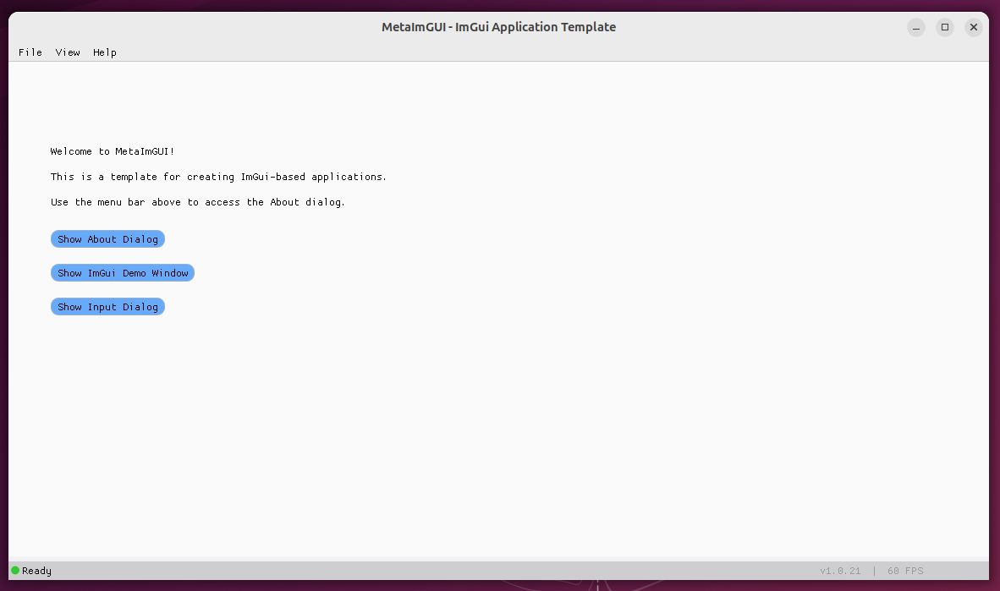
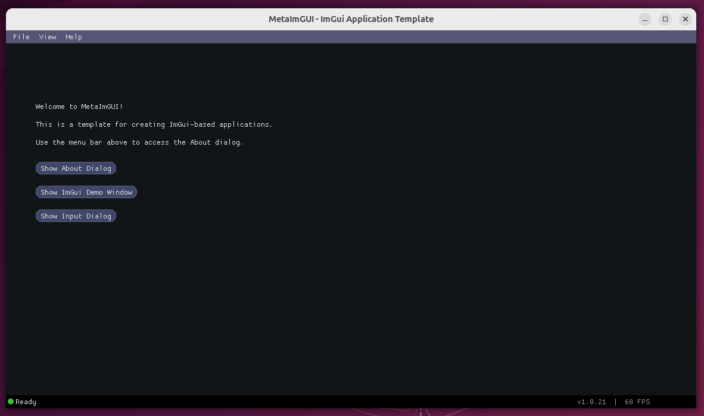
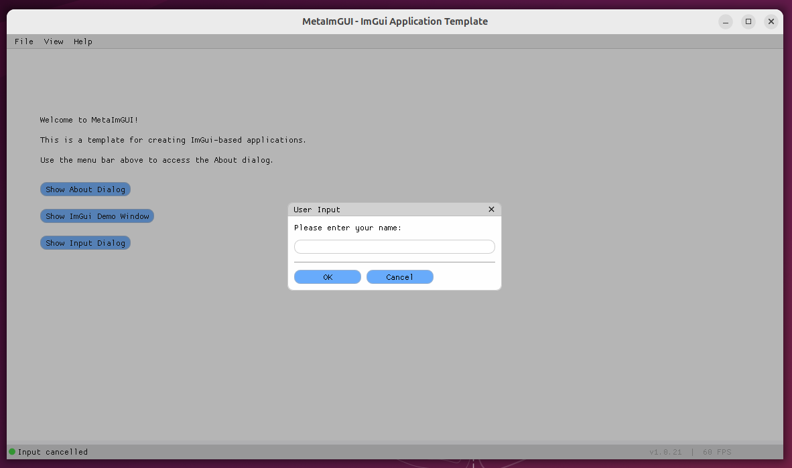
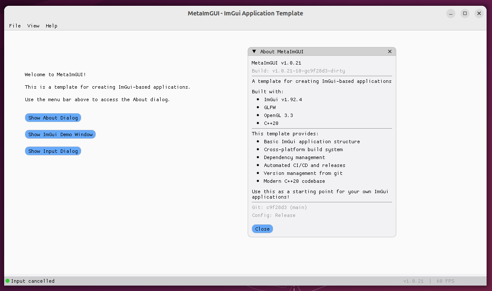
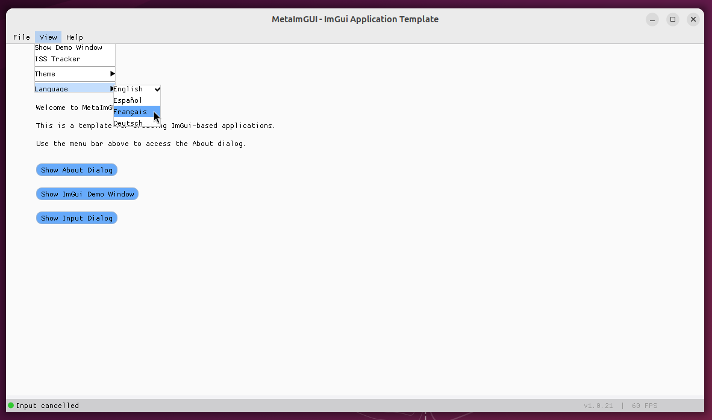
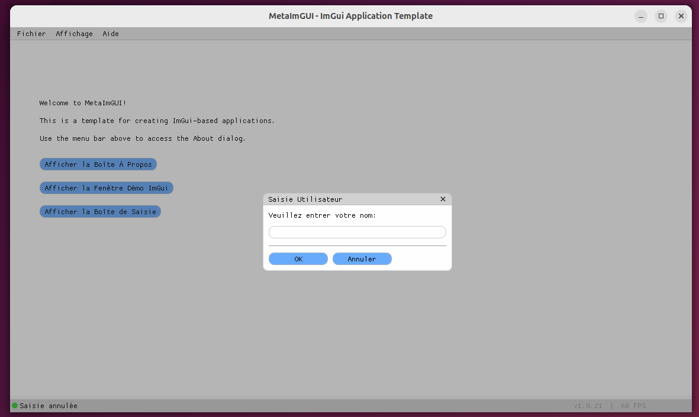
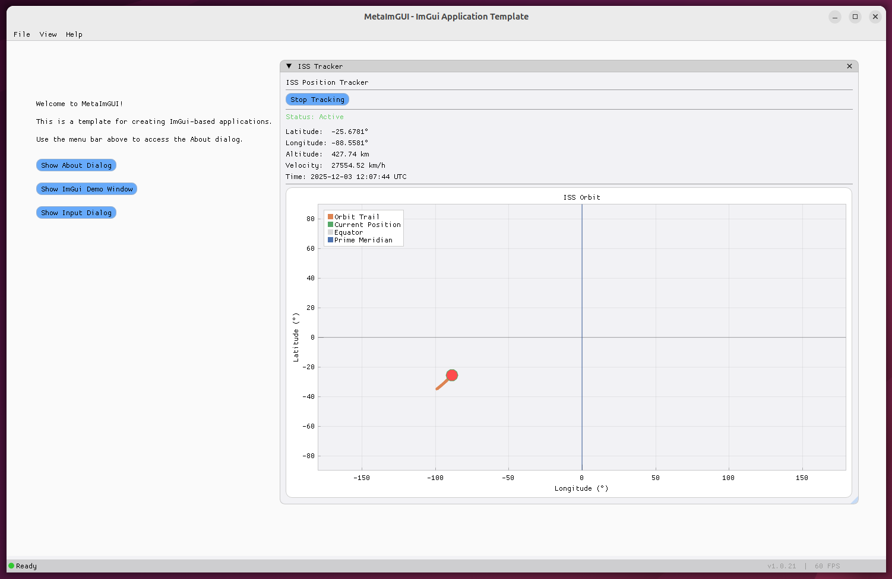

# MetaImGUI

[](https://github.com/andynicholson/MetaImGUI/actions/workflows/ci.yml)
[](https://github.com/andynicholson/MetaImGUI/actions/workflows/release.yml)
[](https://codecov.io/gh/andynicholson/MetaImGUI)
[](https://github.com/andynicholson/MetaImGUI/releases/latest)
[](https://www.gnu.org/licenses/gpl-3.0)
[](https://github.com/andynicholson/MetaImGUI)
[](https://en.cppreference.com/w/cpp/20)
[](https://github.com/ocornut/imgui)

A C++20 template for ImGui desktop applications. Includes build system, CI/CD, and basic application structure.

## Overview

MetaImGUI provides the structure for building ImGui desktop applications. Includes build infrastructure, dependency management, and CI/CD automation.
Designed for efficient development in AI-assisted editors like Cursor.

## Screenshots

### Main Application Window


### Theme Variations


### Dialog System


### About 


### Menu System


### Localisation 


### Example of Real-Time Plotting, via Threaded Network API JSON fetching. 



## Features

### Core Application
- 🚀 C++20 codebase
- 🔧 CMake build system for Linux, Windows, macOS
- 🎨 ImGui v1.92.4 with GLFW and OpenGL 3.3
- 🖼️ Menu bar and about dialog
- ⚙️ JSON configuration (window size, language preference)
- 📝 Thread-safe logging (console and file)
- 💬 Dialog system (message boxes, confirmation, input, progress)
- 🌍 Localization (English, Spanish, French, German)

### Build & Infrastructure
- ⚡ CI/CD workflows (builds on every push)
- 📦 Automated releases (create tag, get installers)
- 🔔 Update checker (GitHub API)
- 🏷️ Git-based versioning
- 🎯 Init script (renames project, updates namespaces)
- ✅ Catch2 tests
- 🧪 Code coverage tracking (Codecov)
- 🛡️ Sanitizers (AddressSanitizer, UndefinedBehaviorSanitizer, ThreadSanitizer)
- 🔍 Static analysis (clang-tidy, cppcheck)
- 🔒 Security scanning (CodeQL)
- 📊 Performance benchmarks (Google Benchmark)
- 📋 Packaging (AppImage, .deb, NSIS installer, DMG)
- 🤖 VS Code configuration

> **See [META_FEATURES.md](META_FEATURES.md) for detailed documentation of all features.**

## Project Structure

```
MetaImGUI/
├── CMakeLists.txt              # Main build configuration
├── CMakePresets.json           # CMake preset configurations
├── README.md                   # This file
├── LICENSE                     # GPL v3.0 license
├── AUTHORS                     # Project contributors
├── CHANGELOG.md                # Version history and changes
├── CODE_OF_CONDUCT.md          # Community guidelines
├── CONTRIBUTING.md             # Contribution guidelines
├── SECURITY.md                 # Security policy
├── SECURITY_CHECKLIST.md       # Security best practices
├── META_FEATURES.md            # Detailed feature documentation
├── QUICK_REFERENCE.md          # Quick reference guide
├── SETUP_GUIDE.md              # Setup instructions
├── GITHUB_ACTIONS_GUIDE.md     # GitHub Actions documentation
├── Doxyfile                    # Doxygen configuration
├── entitlements.plist          # macOS entitlements
│
├── src/                        # Source files
│   ├── main.cpp               # Application entry point
│   ├── Application.cpp        # Main application logic
│   ├── WindowManager.cpp      # Window management
│   ├── ThemeManager.cpp       # Theme/styling system
│   ├── UIRenderer.cpp         # UI rendering logic
│   ├── UpdateChecker.cpp      # Update notification system
│   ├── ConfigManager.cpp      # Settings persistence
│   ├── Logger.cpp             # Logging system
│   ├── DialogManager.cpp      # Dialog system
│   └── Localization.cpp       # Localization/translations
│
├── include/                    # Header files
│   ├── Application.h          # Application header
│   ├── WindowManager.h        # Window manager header
│   ├── ThemeManager.h         # Theme manager header
│   ├── UIRenderer.h           # UI renderer header
│   ├── UpdateChecker.h        # Update checker header
│   ├── ConfigManager.h        # Config manager header
│   ├── Logger.h               # Logger header
│   ├── DialogManager.h        # Dialog manager header
│   ├── Localization.h         # Localization header
│   └── version.h.in           # Version template
│
├── tests/                      # Test suite (Catch2)
│   ├── test_main.cpp          # Test runner
│   ├── test_theme_manager.cpp # Theme tests
│   ├── test_update_checker.cpp# Update checker tests
│   ├── test_version.cpp       # Version tests
│   ├── test_config_manager.cpp# Config manager tests
│   ├── test_logger.cpp        # Logger tests
│   └── test_window_manager.cpp# Window manager tests
│
├── benchmarks/                 # Performance benchmarks (Google Benchmark)
│   ├── CMakeLists.txt         # Benchmark build configuration
│   ├── benchmark_main.cpp     # Benchmark entry point
│   ├── benchmark_config.cpp   # ConfigManager benchmarks
│   ├── benchmark_logger.cpp   # Logger benchmarks
│   └── benchmark_localization.cpp # Localization benchmarks
│
├── cmake/                      # CMake modules
│   ├── GetGitVersion.cmake    # Git version extraction
│   ├── CodeCoverage.cmake     # Code coverage configuration
│   ├── Sanitizers.cmake       # Sanitizer configuration
│   └── StaticAnalysis.cmake   # Static analysis configuration
│
├── scripts/                    # Utility scripts
│   ├── monitor_actions.sh     # Linux/macOS workflow monitor
│   ├── monitor_actions.ps1    # Windows workflow monitor
│   ├── prepare_release.sh     # Interactive release preparation
│   ├── quick_status.sh        # Quick status check
│   ├── run_clang_tidy.sh      # Run clang-tidy locally
│   ├── run_coverage.sh        # Generate coverage report
│   ├── run_sanitizers.sh      # Run sanitizers locally
│   ├── run_static_analysis.sh # Run static analysis
│   └── README.md              # Scripts documentation
│
├── packaging/                  # Platform-specific packaging
│   ├── create_linux_packages.sh   # Linux package creation
│   ├── create_windows_installer.ps1 # Windows installer
│   ├── windows_installer.nsi  # NSIS installer script
│   ├── PACKAGING_GUIDE.md     # Packaging documentation
│   ├── README.md              # Packaging overview
│   ├── flatpak/               # Flatpak packaging
│   │   ├── com.metaimgui.MetaImGUI.desktop
│   │   ├── com.metaimgui.MetaImGUI.metainfo.xml
│   │   └── com.metaimgui.MetaImGUI.yaml
│   └── snap/                  # Snap packaging
│       └── snapcraft.yaml
│
├── .github/                    # GitHub configuration
│   ├── workflows/             # GitHub Actions CI/CD
│   │   ├── ci.yml            # Continuous Integration
│   │   ├── coverage.yml      # Code coverage analysis
│   │   ├── sanitizers.yml    # Memory safety checks
│   │   ├── static-analysis.yml # clang-tidy + cppcheck
│   │   ├── codeql.yml        # Security analysis (CodeQL)
│   │   ├── benchmarks.yml    # Performance benchmarks
│   │   ├── docs.yml          # Documentation generation
│   │   ├── dependency-review.yml # Dependency scanning
│   │   └── release.yml       # Release automation
│   ├── ISSUE_TEMPLATE/        # Issue templates
│   └── PULL_REQUEST_TEMPLATE.md
│
├── .devcontainer/              # VS Code Dev Container
│   ├── devcontainer.json      # Container configuration
│   ├── Dockerfile             # Container image
│   └── post-create.sh         # Post-creation script
│
├── .vscode/                    # VS Code workspace settings
│
├── docs/                       # Documentation
│   ├── README.md              # Documentation index
│   ├── mainpage.md            # Doxygen main page
│   ├── file-dialogs.md        # File dialog documentation
│   ├── plugin-architecture.md # Plugin system design
│   └── security-practices.md  # Security guidelines
│
├── resources/                  # Application resources
│   ├── README.md              # Resources overview
│   ├── translations/          # Translation files
│   │   └── translations.json # Multi-language strings
│   └── icons/                 # Application icons
│       ├── README.md          # Icon documentation
│       ├── metaimgui.svg      # Source icon
│       └── generate_icons.sh  # Icon generation script
│
├── setup_dependencies.sh/.bat  # Dependency setup scripts
├── build.sh/.bat              # Build scripts
├── init_template.sh/.ps1      # Project initialization scripts
│
├── external/                   # External dependencies (generated)
│   ├── imgui/                 # ImGui library
│   ├── json/                  # nlohmann/json
│   └── catch2/                # Catch2 testing framework
│
├── build/                      # Build output (generated)
└── logs/                       # Application logs (generated)
```

## Development Environment

### VS Code Devcontainer (Recommended)

The easiest way to get started is using the pre-configured development container:

1. Install [Docker](https://docs.docker.com/get-docker/) and [VS Code](https://code.visualstudio.com/)
2. Install the [Dev Containers extension](https://marketplace.visualstudio.com/items?itemName=ms-vscode-remote.remote-containers)
3. Open the project in VS Code
4. Click "Reopen in Container" when prompted
5. Wait for the container to build (first time only)
6. Start developing!

The devcontainer includes all tools pre-installed: compilers, CMake, sanitizers, coverage tools, and more.

See [`.devcontainer/README.md`](.devcontainer/README.md) for details.

## Quick Start

### Using as a Template for Your Project

The recommended workflow:

```bash
# 1. Fork this repository on GitHub (click the "Fork" button)

# 2. Clone your fork (replace YOUR_USERNAME with your GitHub username)
git clone https://github.com/YOUR_USERNAME/MetaImGUI.git MyProject
cd MyProject

# 3. Initialize your project (interactive)
./init_template.sh
# Follow the prompts to customize project name, namespace, etc.

# 4. Setup dependencies
./setup_dependencies.sh

# 5. Build
./build.sh

# 6. Run
./build/MyProject

# 7. Open in your AI-assisted editor (e.g., Cursor) and start developing
cursor .

# 8. When ready, create your first release
./scripts/prepare_release.sh
# Interactive script will guide you through version bumping and release creation
# GitHub Actions will build installers for all platforms
```

### Prerequisites

**All Platforms:**
- 🔨 CMake 3.16 or higher
- ⚙️ C++20 compatible compiler (GCC 10+, Clang 10+, MSVC 2019 16.11+)
- 🌿 Git (for downloading dependencies)

**Platform-Specific:**
- 🐧 **Linux**: `libcurl4-openssl-dev`, `libglfw3-dev`, `libgl1-mesa-dev`, `libglu1-mesa-dev`, `xorg-dev`
- 🪟 **Windows**: vcpkg (for GLFW and libcurl)
- 🍎 **macOS**: Homebrew (for GLFW and other dependencies)

### Building Without Initialization

If you just want to try the template as-is:

```bash
# Setup dependencies
chmod +x setup_dependencies.sh
./setup_dependencies.sh

# Build
chmod +x build.sh
./build.sh

# Run
./build/MetaImGUI
```

## Building Manually

If you prefer to build manually:

```bash
mkdir build
cd build
cmake ..
make -j$(nproc)  # or make -j4 on Windows
```

## Customization

### Renaming the Project

**Recommended: Use the initialization script**
```bash
./init_template.sh  # Linux/macOS
# or
.\init_template.ps1  # Windows
```

The script automatically updates all project files, namespaces, and configurations.

**Manual customization** (if needed):
1. Update `CMakeLists.txt` - Change project name and executable references
2. Update all source files - Change namespace from `MetaImGUI` to your name
3. Update `include/` headers - Update WINDOW_TITLE and other constants
4. Update GitHub URLs in badges and documentation

### Architecture Overview

Modular structure:

- **Application** - Lifecycle and coordination
- **WindowManager** - GLFW window wrapper
- **ThemeManager** - UI theming (4 themes: Dark, Light, Classic, Modern)
- **UIRenderer** - ImGui rendering
- **UpdateChecker** - Update notifications via GitHub API
- **ConfigManager** - JSON settings (window state, preferences)
- **Logger** - Thread-safe logging (file and console)
- **DialogManager** - Reusable dialogs (message boxes, input, progress, lists)
- **Localization** - Runtime language switching

### Adding New Features

Extending the template:

- **UI components** - Add methods to `UIRenderer`
- **Themes** - Add color schemes to `ThemeManager`
- **Menu items** - Edit `UIRenderer::RenderMenuBar()`
- **Dialogs** - Use `DialogManager` methods
- **Settings** - Use `ConfigManager` get/set methods
- **Logging** - Use `Logger::Instance()` with LOG_INFO, LOG_ERROR, LOG_DEBUG
- **Translations** - Edit `resources/translations/translations.json`
- **New managers** - Follow existing manager patterns

### Working with AI Assistants

Structured for AI-assisted editors:

- Standard C++ patterns
- Consistent naming conventions
- Clear separation of concerns
- Straightforward file organization

### GitHub Actions and Monitoring

GitHub Actions workflows:

- **CI Build** - Builds and tests on Linux, Windows, macOS
- **Code Coverage** - Coverage tracking via Codecov
- **Sanitizers** - AddressSanitizer, UndefinedBehaviorSanitizer, ThreadSanitizer
- **Static Analysis** - clang-tidy, cppcheck
- **Security Analysis** - CodeQL scanning
- **Benchmarks** - Google Benchmark
- **Release** - Builds installers on tag push

**Advanced Workflow Management:**

```bash
# Monitor all workflows in real-time
./scripts/monitor_actions.sh

# Watch workflows with auto-refresh
./scripts/monitor_actions.sh watch

# Cancel all running workflows
./scripts/monitor_actions.sh cancel

# Delete all failed/cancelled workflow runs
./scripts/monitor_actions.sh delete

# Show help
./scripts/monitor_actions.sh help
```

For detailed information, see:
- **Workflow monitoring**: `scripts/README.md`
- **Complete guide**: `GITHUB_ACTIONS_GUIDE.md`
- **Release preparation**: `./scripts/prepare_release.sh --help`

## Documentation

- **API Documentation**: [https://andynicholson.github.io/MetaImGUI/](https://andynicholson.github.io/MetaImGUI/)
- **Quick Reference**: [QUICK_REFERENCE.md](QUICK_REFERENCE.md)
- **Setup Guide**: [SETUP_GUIDE.md](SETUP_GUIDE.md)
- **Meta Features**: [META_FEATURES.md](META_FEATURES.md)
- **GitHub Actions Guide**: [GITHUB_ACTIONS_GUIDE.md](GITHUB_ACTIONS_GUIDE.md)
- **Contributing**: [CONTRIBUTING.md](CONTRIBUTING.md)

To generate documentation locally:
```bash
# Install Doxygen and Graphviz
sudo apt-get install doxygen graphviz  # Ubuntu/Debian
brew install doxygen graphviz          # macOS

# Generate docs
doxygen Doxyfile

# Open docs/api/html/index.html in browser
```

## Dependencies

### Core Dependencies
- 🎨 ImGui v1.92.4
- 🪟 GLFW 3.x
- 🎮 OpenGL 3.3
- 🌐 libcurl (update checking)
- 📦 nlohmann/json v3.11.3

### Build & Development
- 🔨 CMake 3.16+
- ✅ Catch2 v3.x
- 🛠️ C++20 compiler (GCC 10+, Clang 10+, MSVC 2019 16.11+)

## Platform Support

- 🐧 Linux (Ubuntu 20.04+, Fedora 33+)
- 🪟 Windows (10/11 with MSVC)
- 🍎 macOS (15+)

Tested via GitHub Actions.

## Troubleshooting

### Common Issues

1. **ImGui not found**: Run `./setup_dependencies.sh` first
2. **GLFW not found**: Install system dependencies via the setup script
3. **OpenGL errors**: Ensure your graphics drivers are up to date
4. **Build failures**: Check that you have a C++20 compatible compiler

### Debug Mode

Build with debug information:
```bash
cd build
cmake -DCMAKE_BUILD_TYPE=Debug ..
make
```

## License

This project is licensed under the GNU General Public License v3.0 - see the [LICENSE](LICENSE) file for details.

## Use Cases

Suitable for:

- 🔧 Desktop utilities
- 📊 Data visualization
- ⚙️ Configuration interfaces
- 🎨 GUI prototypes
- 🌍 Cross-platform desktop apps

## Contributing

Issues and pull requests welcome.

### Commit Message Convention

We follow [Conventional Commits](https://www.conventionalcommits.org/) for clear and structured commit history. This enables automatic changelog generation and semantic versioning.

**Format:**
```
<type>(<scope>): <description>

[optional body]

[optional footer]
```

**Quick Reference:**

| Type | Use When | Example |
|------|----------|---------|
| `feat` | New feature | `feat: add export to PDF` |
| `fix` | Bug fix | `fix: prevent null pointer crash` |
| `docs` | Documentation | `docs: update API reference` |
| `style` | Formatting | `style: apply clang-format` |
| `refactor` | Code restructure | `refactor: simplify error handling` |
| `perf` | Performance | `perf: cache configuration reads` |
| `test` | Testing | `test: add integration tests` |
| `build` | Build/deps | `build: update CMake to 3.20` |
| `ci` | CI/CD | `ci: add coverage reporting` |
| `chore` | Maintenance | `chore: update .gitignore` |

**Examples:**
```bash
feat: add benchmark suite for logger
fix(ui): resolve dialog positioning bug
docs(readme): update installation instructions
feat(config)!: change API signature (breaking change)
```

**Breaking Changes:**
Add `!` after type/scope or include `BREAKING CHANGE:` in the footer:
```bash
feat!: change Initialize() API signature
```

See [CONTRIBUTING.md](CONTRIBUTING.md) for detailed guidelines.

## Acknowledgments

- [ImGui](https://github.com/ocornut/imgui) by Omar Cornut
- [GLFW](https://www.glfw.org/)
- [Catch2](https://github.com/catchorg/Catch2)
- [nlohmann/json](https://github.com/nlohmann/json) by Niels Lohmann
- [libcurl](https://curl.se/libcurl/)
